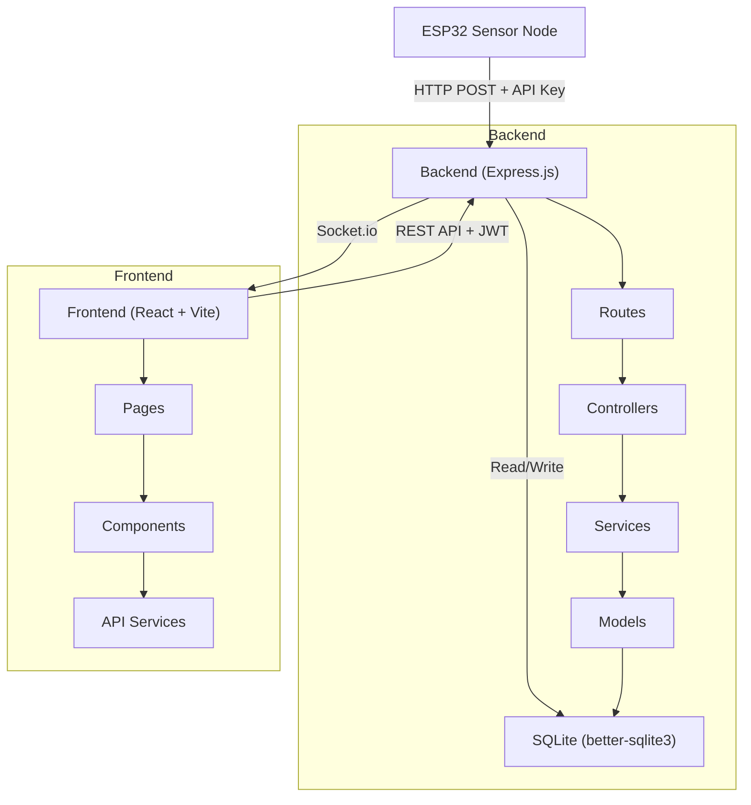

# PRIME System — Full-Stack Implementation Plan

**PRIME** (Palay Resource and Irrigation Monitoring for Fertilizer Efficiency) — a real-time agricultural monitoring and nutrient assessment system for single-farm deployment.

## Architecture Overview



| Layer | Technology |
|-------|-----------|
| Frontend | React 18 + Vite, Tailwind CSS, Recharts, Socket.io-client |
| Backend | Node.js + Express.js, Socket.io, better-sqlite3, JWT, bcrypt |
| Database | SQLite (file-based, single-farm scale) |
| Sensor Comm | HTTP POST with device API key header |
| Real-time | Socket.io (server → client push on new readings) |

---

## Phase 1 — Backend Foundation

### Database Schema

#### [NEW] [schema.sql](file:///c:/Users/reshd/OneDrive/Desktop/PRIME_System/backend/src/database/schema.sql)

9 tables with full relationships:

| Table | Key Columns | Purpose |
|-------|-------------|---------|
| `users` | id, username, password_hash, role (farmer/admin), is_active | Auth & RBAC |
| `fields` | id, name, location, area_hectares, crop_type, growth_stage, user_id | Farm field registry |
| `devices` | id, device_code, api_key, field_id, status, battery_level, last_communication | ESP32 devices |
| `sensor_readings` | id, device_id, field_id, soil_moisture, water_level, nitrogen, phosphorus, potassium, timestamp | Raw sensor data |
| `reference_values` | id, nutrient, growth_stage, min_sufficient, max_sufficient, updated_by | SSNM/NOPT thresholds |
| `recommendations` | id, sensor_reading_id, field_id, n_status, p_status, k_status, fertilizer_type, application_rate, recommendation_text | Assessment results |
| `fertilizer_logs` | id, field_id, user_id, fertilizer_type, amount_kg, notes, applied_at | Farmer-recorded applications |
| `alerts` | id, field_id, user_id, type, message, severity, is_read | System-generated alerts |
| `activity_logs` | id, user_id, action, entity_type, entity_id, details, timestamp | Audit trail |

#### [NEW] [seed.js](file:///c:/Users/reshd/OneDrive/Desktop/PRIME_System/backend/src/database/seed.js)

- Creates all tables from schema.sql
- Seeds demo Farmer account: `farmer1` / `password123`
- Seeds demo Admin account: `admin1` / `password123`
- Seeds a demo field, device, reference values (N/P/K thresholds per growth stage), and ~20 sample sensor readings with recommendations

---

### Config & Middleware

#### [NEW] [db.js](file:///c:/Users/reshd/OneDrive/Desktop/PRIME_System/backend/src/config/db.js)
- Initializes better-sqlite3 connection with WAL mode
- Exports singleton db instance

#### [NEW] [auth.middleware.js](file:///c:/Users/reshd/OneDrive/Desktop/PRIME_System/backend/src/middleware/auth.middleware.js)
- Verifies JWT from `Authorization: Bearer <token>` header
- Attaches `req.user` with { id, username, role }

#### [NEW] [role.middleware.js](file:///c:/Users/reshd/OneDrive/Desktop/PRIME_System/backend/src/middleware/role.middleware.js)
- Factory function `requireRole('admin')` — checks `req.user.role`

#### [NEW] [deviceKey.middleware.js](file:///c:/Users/reshd/OneDrive/Desktop/PRIME_System/backend/src/middleware/deviceKey.middleware.js)
- Validates `x-device-api-key` header against devices table
- Attaches `req.device` with device info

#### [NEW] [errorHandler.js](file:///c:/Users/reshd/OneDrive/Desktop/PRIME_System/backend/src/middleware/errorHandler.js)
- Global Express error handler with structured JSON responses

#### [NEW] [jwt.js](file:///c:/Users/reshd/OneDrive/Desktop/PRIME_System/backend/src/utils/jwt.js)
- `generateToken(user)` and `verifyToken(token)` utility functions

---

### Models (Database Access Layer)

Each model exports pure functions that accept the db instance, keeping SQL isolated:

| Model | Key Operations |
|-------|---------------|
| `user.model.js` | findByUsername, findById, create, updateStatus, getAll |
| `field.model.js` | create, findByUserId, findById, getAll |
| `device.model.js` | findByApiKey, findByDeviceCode, updateStatus, getAll |
| `sensorReading.model.js` | create, findByFieldId, getLatestByFieldId, getStats |
| `recommendation.model.js` | create, findByFieldId, getLatestByFieldId, getStats |
| `fertilizerLog.model.js` | create, findByFieldId, getByUserId |
| `alert.model.js` | create, findByUserId, markAsRead, getUnreadCount |
| `referenceValue.model.js` | getAll, getByNutrientAndStage, upsert |
| `activityLog.model.js` | create, getAll, getRecent |

---

### Services (Business Logic)

#### [NEW] [nutrientAssessment.service.js](file:///c:/Users/reshd/OneDrive/Desktop/PRIME_System/backend/src/services/nutrientAssessment.service.js)

**Core SSNM/NOPT engine:**

```
Input: { nitrogen, phosphorus, potassium, growth_stage }
1. Fetch reference values for each nutrient + growth_stage
2. Classify each: value < min → "Deficient", min ≤ value ≤ max → "Sufficient", value > max → "Excess"
3. Generate fertilizer recommendation based on classification combination
4. Return { n_status, p_status, k_status, fertilizer_type, application_rate, recommendation_text }
```

#### [NEW] [recommendation.service.js](file:///c:/Users/reshd/OneDrive/Desktop/PRIME_System/backend/src/services/recommendation.service.js)
- Orchestrates: validate reading → assess nutrients → save recommendation → trigger alerts → broadcast via Socket.io

#### [NEW] [alert.service.js](file:///c:/Users/reshd/OneDrive/Desktop/PRIME_System/backend/src/services/alert.service.js)
- Generates alerts for deficient/excess nutrients, invalid sensor readings, device offline events

#### [NEW] [socket.service.js](file:///c:/Users/reshd/OneDrive/Desktop/PRIME_System/backend/src/services/socket.service.js)
- Manages Socket.io instance, emits `new-sensor-reading`, `new-recommendation`, `new-alert` events

---

### Controllers & Routes

10 route/controller pairs mapping directly to the specified files:

| Endpoint Group | Key Routes | Auth |
|---------------|-----------|------|
| `/api/auth` | POST /login, POST /register, GET /me | Public (login/register), JWT (me) |
| `/api/sensors` | POST /readings (ESP32), GET /readings, GET /readings/latest | Device key (POST), JWT (GET) |
| `/api/recommendations` | GET /, GET /latest, GET /stats | JWT |
| `/api/fertilizer` | POST /, GET / | JWT (farmer) |
| `/api/alerts` | GET /, PATCH /:id/read, GET /unread-count | JWT |
| `/api/reports` | GET /farmer, GET /admin | JWT + role |
| `/api/devices` | GET /, POST /, PATCH /:id | JWT (admin) |
| `/api/reference` | GET /, PUT / | JWT (admin for PUT) |
| `/api/users` | GET /, POST /, PATCH /:id/status | JWT (admin) |
| `/api/activity` | GET / | JWT (admin) |

#### [NEW] [app.js](file:///c:/Users/reshd/OneDrive/Desktop/PRIME_System/backend/src/app.js)
- Express app setup with CORS, JSON parsing, all route mounts, error handler

#### [NEW] [server.js](file:///c:/Users/reshd/OneDrive/Desktop/PRIME_System/backend/server.js)
- Creates HTTP server, attaches Socket.io, starts listening

---

## Phase 2 — Frontend Application

### Project Setup

- Vite + React 18 via `create-vite`
- Tailwind CSS v3
- Dependencies: `recharts`, `socket.io-client`, `react-router-dom`, `axios`, `lucide-react` (icons)

### Design System

- **Color palette**: Agricultural greens (#166534, #15803d, #22c55e), earth tones (#92400e, #b45309), sky blues for water (#0284c7), warm reds for alerts (#dc2626)
- **Dark sidebar** with light content area
- **Status colors**: Deficient (red), Sufficient (green), Excess (amber)
- **Cards** with subtle shadows, rounded corners
- **Responsive**: sidebar collapses on mobile

### Auth & Routing

#### [NEW] [AuthContext.jsx](file:///c:/Users/reshd/OneDrive/Desktop/PRIME_System/frontend/src/context/AuthContext.jsx)
- JWT stored in localStorage, provides `login()`, `logout()`, `user` object
- Socket.io connection managed at context level

#### [NEW] [AppRouter.jsx](file:///c:/Users/reshd/OneDrive/Desktop/PRIME_System/frontend/src/routes/AppRouter.jsx)
- `/login` → Login page
- `/farmer/*` → Farmer layout + protected routes
- `/admin/*` → Admin layout + protected routes
- Redirect based on role after login

### Layouts

| Layout | Features |
|--------|----------|
| `AuthLayout` | Centered card on gradient background |
| `FarmerLayout` | Green sidebar (Dashboard, Recommendations, Fertilizer Log, Alerts, Reports) + Topbar |
| `AdminLayout` | Dark sidebar (Dashboard, Devices, Reference Config, Users, Activity, Reports) + Topbar |

### Pages — Farmer

| Page | Key Features |
|------|-------------|
| `FarmerDashboard` | 4 metric cards (soil moisture, water level, NPK summary, last reading), nutrient status badges, fertilizer recommendation card, NutrientTrendChart, SoilMoistureChart. **Socket.io listener** for live updates. |
| `Recommendations` | DataTable with timestamp, N/P/K status badges, fertilizer type, recommendation text. Filterable. |
| `FertilizerLog` | Form (type, amount, notes) + DataTable of past applications |
| `Alerts` | Alert cards with severity colors, "Mark as Read" button, unread count badge |
| `FarmerReports` | Stats cards (total readings, avg moisture, avg NPK), fertilizer history table |

### Pages — Admin

| Page | Key Features |
|------|-------------|
| `AdminDashboard` | Summary cards (fields, devices, farmers, unread alerts, daily recommendations), recent activity list |
| `DeviceMonitoring` | DataTable with device code, field, status badge (online/offline/fault), battery, last comm |
| `ReferenceConfig` | Editable table/form for N/P/K min/max per growth stage. Save records who modified. |
| `UserManagement` | DataTable with username, role, status. Create user modal. Activate/deactivate toggle. |
| `ActivityLogs` | DataTable with timestamp, user, action, entity, details. Paginated. |
| `AdminReports` | Nutrient classification pie/bar chart (deficient/sufficient/excess counts via Recharts), system stats |

### Charts (Recharts)

#### [NEW] [NutrientTrendChart.jsx](file:///c:/Users/reshd/OneDrive/Desktop/PRIME_System/frontend/src/components/charts/NutrientTrendChart.jsx)
- LineChart with 3 lines (N, P, K) over time
- Reference lines for threshold boundaries

#### [NEW] [SoilMoistureChart.jsx](file:///c:/Users/reshd/OneDrive/Desktop/PRIME_System/frontend/src/components/charts/SoilMoistureChart.jsx)
- AreaChart for soil moisture + line for water level over time

### Common Components

| Component | Purpose |
|-----------|---------|
| `Card` | Rounded container with title, value, icon, optional trend |
| `Button` | Primary/secondary/danger variants with loading state |
| `Modal` | Overlay dialog for forms and confirmations |
| `DataTable` | Sortable, paginated table with empty state |
| `StatusBadge` | Colored badge for Deficient/Sufficient/Excess/Online/Offline |
| `AlertBanner` | Top-of-page notification for success/error/warning |
| `Sidebar` | Navigation with active state highlighting |
| `Topbar` | User info, notifications bell, logout |
| `ProtectedRoute` | Checks JWT + role, redirects to login |

### Frontend Services

Each service module wraps Axios calls to the corresponding backend endpoint group, with JWT header injection via Axios interceptor.

---

## Phase 3 — Integration & Real-Time

1. Socket.io server broadcasts on sensor ingestion pipeline completion
2. Frontend connects on login, subscribes to field-specific rooms
3. Dashboard components listen for `new-sensor-reading`, `new-recommendation`, `new-alert`
4. ESP32 simulation: seed.js includes sample data; a curl command demonstrates the POST endpoint

---

## Environment Files

#### [NEW] `.env.example` (backend)
```
PORT=3000
JWT_SECRET=your_jwt_secret_here
DB_PATH=./prime.db
CORS_ORIGIN=http://localhost:5173
```

#### [NEW] `.env.example` (frontend)
```
VITE_API_URL=http://localhost:3000/api
VITE_SOCKET_URL=http://localhost:3000
```

---

## Verification Plan

### Automated Tests
```bash
# Backend starts without errors
cd backend && npm install && node src/database/seed.js && node server.js

# Frontend builds without errors
cd frontend && npm install && npm run build
```

### Manual Verification
1. Run seed → verify demo accounts login via `/api/auth/login`
2. Login as farmer → dashboard loads with seed sensor data and charts
3. Login as admin → dashboard shows system summary
4. Simulate ESP32 POST → verify real-time dashboard update via Socket.io
5. Test all CRUD operations across both roles
6. Verify role-based route protection (farmer cannot access admin pages and vice versa)

---

## Execution Order

| Step | Files | Dependency |
|------|-------|-----------|
| 1 | Backend: `.env`, `package.json`, `db.js`, `schema.sql`, `seed.js` | None |
| 2 | Backend: `jwt.js`, all middleware | Step 1 |
| 3 | Backend: all models | Step 1 |
| 4 | Backend: all services (nutrient engine, alerts, socket) | Step 3 |
| 5 | Backend: all controllers + routes | Steps 2-4 |
| 6 | Backend: `app.js`, `server.js` | Step 5 |
| 7 | Frontend: Vite scaffold, Tailwind, deps | None |
| 8 | Frontend: `index.css`, common components | Step 7 |
| 9 | Frontend: AuthContext, services, layouts, router | Step 8 |
| 10 | Frontend: all pages + charts | Step 9 |
| 11 | Integration testing | Steps 6 + 10 |

> [!IMPORTANT]
> This is a large application (~60+ files). I'll build it methodically following the execution order above, ensuring each layer compiles before proceeding to the next.
