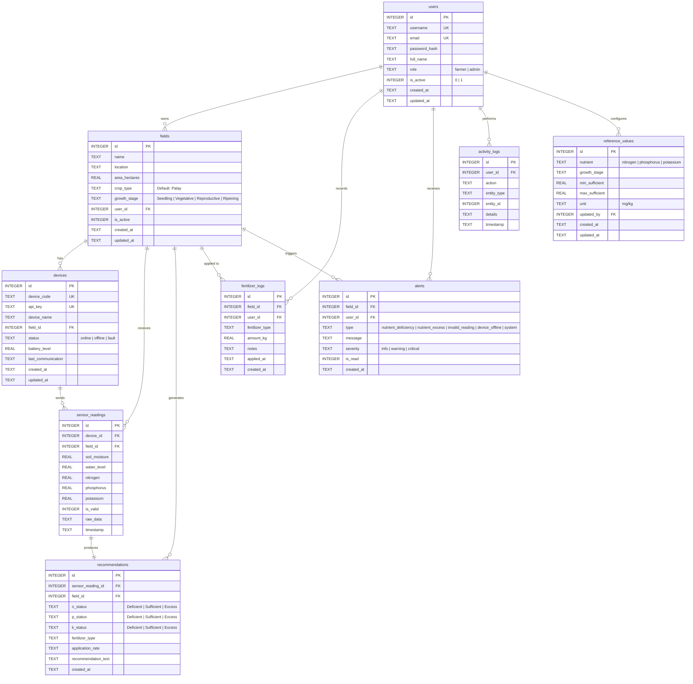
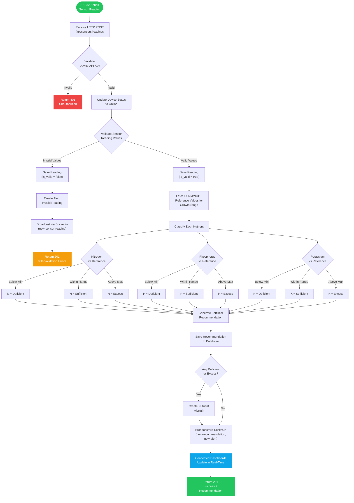
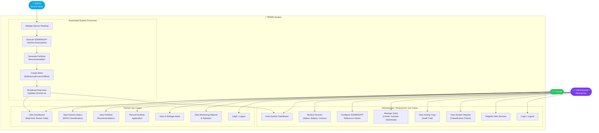
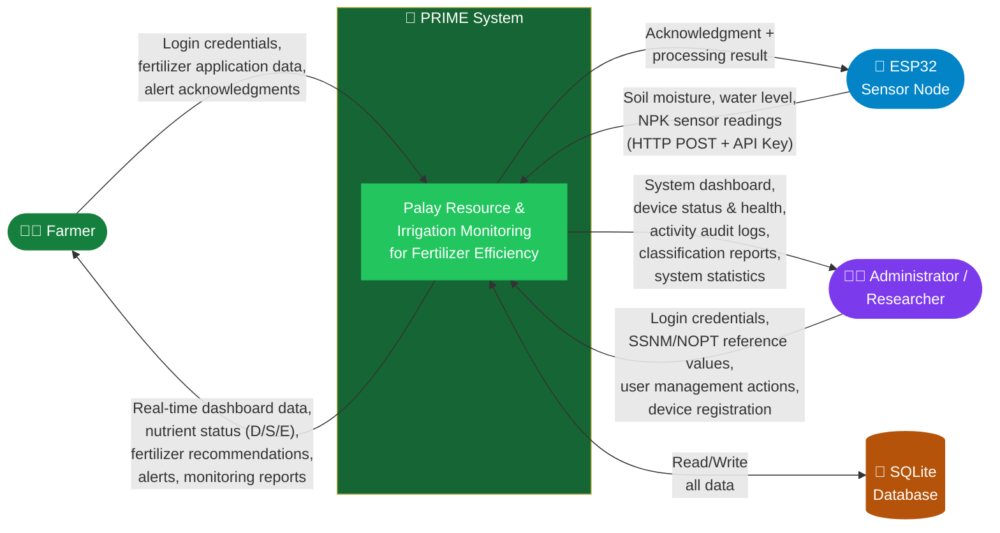

# PRIME System — Diagrams

## 1. Database Schema (Entity-Relationship Diagram)

---

## 2. Activity Diagram — Sensor Ingestion Pipeline

This shows the flow from when an ESP32 sensor sends a reading through the complete processing pipeline.

---

## 3. Use Case Diagram

---

## 4. Context Diagram (Level 0 DFD)

---

## 5. Database Schema Summary Table

| Table | Rows (Seed) | Primary Key | Foreign Keys | Purpose |
|-------|-------------|-------------|--------------|---------|
| `users` | 2 | `id` | — | Farmer & admin accounts |
| `fields` | 2 | `id` | `user_id` → users | Farm field registry |
| `devices` | 2 | `id` | `field_id` → fields | ESP32 sensor nodes |
| `sensor_readings` | 21 | `id` | `device_id` → devices, `field_id` → fields | Raw sensor data |
| `reference_values` | 12 | `id` | `updated_by` → users | SSNM/NOPT thresholds (3 nutrients × 4 stages) |
| `recommendations` | 21 | `id` | `sensor_reading_id` → sensor_readings, `field_id` → fields | Nutrient assessment results |
| `fertilizer_logs` | 3 | `id` | `field_id` → fields, `user_id` → users | Farmer-recorded applications |
| `alerts` | 4+ | `id` | `field_id` → fields, `user_id` → users | System-generated notifications |
| `activity_logs` | 5+ | `id` | `user_id` → users | Audit trail |

### Key Relationships
- **User → Fields**: One farmer owns multiple fields
- **Field → Devices**: One field has one or more ESP32 sensor nodes
- **Device → Sensor Readings**: Each device sends multiple readings
- **Sensor Reading → Recommendation**: Each valid reading generates exactly one recommendation
- **Reference Values**: Configured per nutrient × growth stage, with admin audit trail
